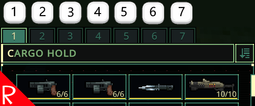

# Quasimorph Tab Hotkeys

Adds hotkeys to the tabs on inventory screens.  
By default maps to number keys, but can be configured.

# Configuration
The configuration file will be created on the first game run and can be found at `%AppData%\..\LocalLow\Magnum Scriptum Ltd\Quasimorph_ModConfigs\TabHotkeys\config.json`.

|Name|Default|Description|
|--|--|--|
|Hotkeys|1 to 0 number keys|The list of hotkeys that directly map to the tab numbers in order.|

## Key List
The list of valid keyboard keys can be found  at the bottom of https://docs.unity3d.com/ScriptReference/KeyCode.html
Beware that numbers 0-9 are Alpha0 - Alpha9.  Most of the other keys are as expected such as X for X.
Use "None" to not bind the key.

# Buy Me a Coffee
If you enjoy my mods and want to buy me a coffee, check out my [Ko-Fi](https://ko-fi.com/nbkredspy71915) page.
Thanks!

# Source Code
Source code is available on GitHub at https://github.com/NBKRedSpy/QM_TabHotkeys

# Change Log

## 1.0.3
* Removed unnecessary files.